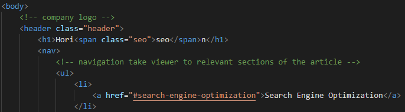
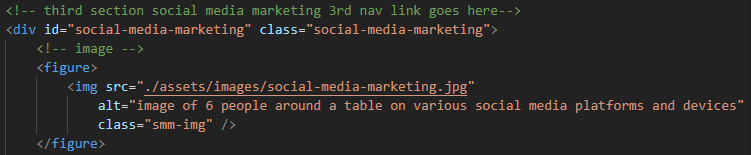

# Horiseon-accessibility-challenge
## Homework assignment week 1

## About this project

This project was about ensuring the Horiseon main web page had good accessibility for people who rely on screen readers to navigate websites. The layout of the website was not changed in any way, but with a few semantics added, it is now easier for screen readers to read. The code was modified so it flowed in logical order and had notes identifying each section, which allows other web developers to easily understand the code. Changes were also made to ensure the site was in full working order. Visual Studios Code (VS Code) was used for this project. 

## Installation 

**Adding Semantic HTML** 

The following elements were used to replace the div elements originally used in the file; header, nav, main, figure and footer. Some of the advantages of these elements include:
1. helping screen readers to understand what the different sections are and where to navigate to
1. helping other coders read the code and know which sections are being referred to
1. improves search engine optimisation
1. tidying up the CSS file because some of the CSS tags can be combined under the one element rather than referring to so many different classes as it was originally written

Another important feature added was the alt attribute within the img tags with a description of the image it relates to. The alt attribute is required because this is what a screen reader will read to the user if they are unable to see the image. Please see Usage section below for examples of these elements. 

**Modifying the flow of the code**

Comments were added throughout the HTML file to help other developers navigate and understand the code. In the CSS file, the order of the elements were changed so that tags referencing the same element were all grouped together e.g. instead of having multiple tags to reference all of the h2 headings, they were regrouped in to one h2 tag. However, the h2 element in the footer of the HTML file needed to be changed to a h4 tag so that the footer would not also change. The h4 tag was chosen based on the level of importance that the footer held on the page i.e. it was considered less important than the h3 tags in the benefits section of the page. 

More meaningful names were given to some of the classes so that when developers looked at the code, they knew exactly what element they were referring to i.e. instead of class=”float-right”, it is now class=”seo-img”. The div class="hero" was changed to div class="background-img" for the same reason. Lastly, the title of the page was changed from “website” to “Horiseon main web page” to have a more meaningful title.

**Fixing the bugs**

One of the links at the top of the page called “search engine optimization” was not working. This is because it was trying to go to an id attribute that was missing. The id “search-engine-optimization” was added to the relevant div in the content below to fix this. 

## Usage

The following shows how the header and nav elements are applied. 

The header goes within the body of the code and is not to be confused with the head element, which is placed outside the body element and contains the title of the page. The nav element is within the header because the links were designed to be at the top of the page and take the user to relevant sections of the article. 

Below is an example of the figure element, comments and alt attribute being applied.

 

The figure element only wraps around the img tag. It is important to include a comment that describes the type of figure being displayed within the figure element. This is because the figure element can be used for more than just images. It is also used for tables, charts, diagrams or any other type of visual element for a page. The figure element has the option of utilising a figcaption element within it, which is used for putting a description of the picture on the page which is visible to both users who are able to view the page and those who rely on screen readers. It was not utilised in this project as the aim was to maintain the current appearance of the web page. 

The alt attribute is located within the img tag with a clear description of the image that screen readers will refer to. Finally, the comment at the top tells developers what this section of the page is and exactly where the navigation links at the top of the page should take them to if they were to click on them. 

## Hopes for the future

To improve the site further, code will need to be added to ensure the page does not significantly change size and have content overflowing it's containers when the browser size is reduced by the user. Web developers are both welcome and encouraged to pull and improve the code within the guidelines of the licences stated below. 
 
## Credits 

Free Code Camp https://www.freecodecamp.org/learn/ 

Stack Overflow https://stackoverflow.com/questions/4870955/in-html5-should-the-main-navigation-be-inside-or-outside-the-header-element#:~:text=It's%20completely%20up%20to%20you,facebook%20account)%20then%20it's%20fine. 

## Contributing

## License

Creative Commons Attribution 4.0 International Public License 

MIT License
